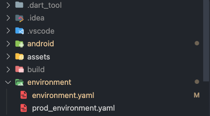

[](https://pub.dev/packages/encrypt_env)
[](https://pub.dev/packages/encrypt_env/publisher)

**encrypt_env** is a Dart CLI tool designed to encrypt sensitive environment variables for Flutter and Dart applications. It helps you secure API keys, secrets, tokens, and other private configuration details by generating encrypted files from YAML definitions.

## Summary

- [Installation](#installation)
- [How it works](#how-it-works)
- [Setup](#setup)
  - [Basic example](#basic-example)
- [Behavior Summary](#behavior-summary)
- [Merging Environments](#merging-environments)
- [Customization](#customization)
  - [Available Flags](#available-flags)
  - [Formats](#formats)
- [Help](#help)

## Installation

Activate globally via Dart:

```sh
dart pub global activate encrypt_env
```

## How it works

The `encrypt_env` CLI reads your `environment.yaml` and generates a Dart class with **static, strongly-typed getters** where **all values are encrypted** at compile time and only decrypted at runtime.

## Setup

You need to organize your project with a folder named `environment` and a file named `environment.yaml`, as shown in the image below:



This file will contain your sensitive environment variables, such as API keys, secrets, tokens, etc.

```text
your_project/
├── environment/
│   └── environment.yaml
```

> Note: You can change the folder and file name by using the --folder and --yaml options when running the CLI. For more details go to the section [Customization](#customization).

### Basic example

Given the following `environment/environment.yaml`:

```yaml
environment:
  base_url: 'http://localhost:3000'
  version: '1.0.0'
  production: false
  headers:
    api-key: 'value'
endpoint:
  endpoint_a: 'endpoint-a'
  endpoint_b: 'endpoint-b'
```

Then, in the root folder, run the following command:

```sh
encrypt_env gen
```

You should see the following log in the console:

```json
Encrypted

{
  "environment": {
    "base_url": "http://localhost:3000",
    "version": "1.0.0",
    "production": false,
    "headers": {
      "api-key": "value"
    }
  },
  "endpoint": {
    "endpoint_a": "endpoint-a",
    "endpoint_b": "endpoint-b"
  }
}

✓ Path lib/environment.dart
```

As indicated in the log, the file `lib/environment.dart` has been generated:

```dart
sealed class Environment {
	/// baseUrl: http://localhost:3000
	static String get baseUrl {
		final List<int> encoded = [0xd5, 0x98, 0x52, 0x52, 0xe6, 0x31, 0x9a, 0x43, 0x4, 0x9b, 0xc0, 0x80, 0x11, 0xf9, 0x2c, 0xeb, 0xd2, 0xa3, 0x2c, 0x1e, 0x38];

		return _decode(encoded);
	}

	/// version: 1.0.0
	static String get version {
		final List<int> encoded = [0x8c, 0xc2, 0x16, 0xc, 0xec];

		return _decode(encoded);
	}

	/// production: false
	static bool get production {
		final List<int> encoded = [0xdb, 0x8d, 0x4a, 0x51, 0xb9];

		return bool.parse(_decode(encoded));
	}

	static Map<String, dynamic> get headers {
		return {
			// api-key: value
			_decode([0xdc, 0x9c, 0x4f, 0xf, 0xb7, 0x7b, 0xcc]): _apiKey,
		};
	}

	/// _apiKey: value
	static String get _apiKey {
		final List<int> encoded = [0xcb, 0x8d, 0x4a, 0x57, 0xb9];

		return _decode(encoded);
	}
}

sealed class Endpoint {
	/// endpointA: endpoint-a
	static String get endpointA {
		final List<int> encoded = [0xd8, 0x82, 0x42, 0x52, 0xb3, 0x77, 0xdb, 0x5b, 0x46, 0x99];

		return _decode(encoded);
	}

	/// endpointB: endpoint-b
	static String get endpointB {
		final List<int> encoded = [0xd8, 0x82, 0x42, 0x52, 0xb3, 0x77, 0xdb, 0x5b, 0x46, 0x9a];

		return _decode(encoded);
	}
}
```

## Merging Environments

You can dynamically merge environment files using the `--environment` flag.

By default, the CLI looks for a base file:

```yaml
# environment/environment.yaml

environment:
  production: false
  base_url: 'http://localhost:3000'
  api_key: 'your_dev_api_key_here'
  database_url: 'your_dev_database_url_here'
endpoint:
  endpoint_a: 'endpoint-a'
  endpoint_b: 'endpoint-b'
```

```yaml
# environment/prod_environment.yaml

environment:
  production: true
  base_url: 'https://api.example.com'
  api_key: 'your_production_api_key_here'
  database_url: 'your_production_database_url_here'
```

```text
environment/
├── environment.yaml # Base config
└── prod_environment.yaml # Overrides
```

```sh
encrypt_env gen --environment prod
```

This will merge both YAMLs, applying all values from `prod_environment.yaml` on top of the base config.

> You can use any prefix (e.g. `staging`, `dev`, `uat`). Just keep the format `prefix_environment.yaml` and match it in `--environment`.

## Customization

You can customize how the CLI reads and writes files using optional flags.

### Available Flags

| Flag                  | Default       | Description                                                                            |
| --------------------- | ------------- | -------------------------------------------------------------------------------------- |
| `--folder`            | `environment` | Folder containing your configuration files                                             |
| `--config`            | `environment` | Base config file name (without `.yaml` extension)                                      |
| `-e`, `--environment` | _none_        | Optional environment name to merge (e.g., `dev`, `prod`)                               |
| `--out-dir`           | `lib`         | Output directory for the generated Dart file                                           |
| `--out-file`          | `environment` | Output Dart file name (without `.dart` extension)                                      |
| `-s`, `--style`       | `cc`          | Getter naming style: `ssc` (SCREAMING_SNAKE_CASE), `cc` (camelCase), `sc` (snake_case) |

## Help

To view all available commands and options, run:

```bash
encrypt_env -h
```
